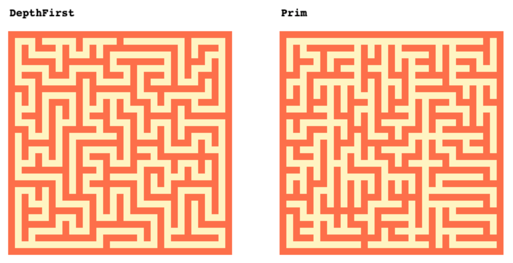

# Maze

Generate 2D mazes, using either [Depth First](https://en.wikipedia.org/wiki/Maze_generation_algorithm#Depth-first_search) or [Prim's](https://en.wikipedia.org/wiki/Maze_generation_algorithm#Randomized_Prim's_algorithm).

# Example

Using optional random seed `"foo"`:

```haxe
import maze.DepthFirst; // or maze.Prim
var maze:Array<Array<Int>> = DepthFirst.make(33, 33, "foo");
```

The result is an int array, with walls `1` and passages `0`.




```
[
    [1,1,1,1,1,1,1,1,1,1,1,1,1,1,1,1,1,1,1,1,1,1,1,1,1,1,1,1,1,1,1,1,1],
    [1,0,0,0,1,0,0,0,0,0,1,0,0,0,0,0,1,0,0,0,0,0,0,0,0,0,1,0,0,0,0,0,1],
    [1,0,1,0,1,1,1,0,1,0,1,0,1,0,1,1,1,1,1,1,1,1,1,1,1,0,1,0,1,1,1,0,1],
    [1,0,1,0,0,0,0,0,1,0,0,0,1,0,1,0,0,0,0,0,0,0,0,0,1,0,1,0,1,0,0,0,1],
    [1,0,1,1,1,1,1,0,1,1,1,1,1,1,1,0,1,1,1,1,1,1,1,0,1,0,1,1,1,0,1,0,1],
    [1,0,0,0,0,0,1,0,1,0,0,0,0,0,1,0,0,0,1,0,0,0,0,0,1,0,1,0,0,0,1,0,1],
    [1,0,1,1,1,0,1,1,1,0,1,1,1,0,1,1,1,0,1,0,1,1,1,0,1,0,1,0,1,1,1,0,1],
    [1,0,0,0,1,0,0,0,0,0,1,0,1,0,0,0,0,0,1,0,1,0,0,0,1,0,0,0,1,0,1,0,1],
    [1,1,1,0,1,1,1,1,1,1,1,0,1,1,1,1,1,1,1,0,1,1,1,1,1,1,1,1,1,0,1,0,1],
    [1,0,1,0,1,0,0,0,0,0,1,0,1,0,0,0,0,0,1,0,0,0,1,0,0,0,0,0,0,0,1,0,1],
    [1,0,1,0,1,0,1,1,1,0,1,0,1,0,1,0,1,0,1,1,1,0,1,0,1,1,1,0,1,1,1,0,1],
    [1,0,0,0,1,0,1,0,1,0,1,0,0,0,1,0,1,0,0,0,1,0,0,0,1,0,1,0,0,0,0,0,1],
    [1,0,1,1,1,0,1,0,1,0,1,0,1,1,1,0,1,1,1,0,1,1,1,1,1,0,1,1,1,1,1,1,1],
    [1,0,0,0,1,0,1,0,0,0,1,0,0,0,1,0,0,0,1,0,1,0,0,0,1,0,0,0,0,0,0,0,1],
    [1,1,1,0,1,0,1,0,1,1,1,1,1,0,1,1,1,0,1,0,1,0,1,0,1,0,1,1,1,1,1,0,1],
    [1,0,1,0,0,0,1,0,1,0,0,0,0,0,0,0,1,0,1,0,0,0,1,0,1,0,1,0,0,0,1,0,1],
    [1,0,1,1,1,1,1,0,1,0,1,1,1,1,1,1,1,0,1,1,1,1,1,0,1,1,1,0,1,0,1,0,1],
    [1,0,1,0,0,0,1,0,1,0,1,0,0,0,0,0,1,0,1,0,0,0,1,0,0,0,0,0,1,0,0,0,1],
    [1,0,1,0,1,0,1,0,1,0,1,0,1,1,1,0,1,0,1,1,1,0,1,1,1,1,1,1,1,1,1,0,1],
    [1,0,0,0,1,0,0,0,1,0,1,0,0,0,1,0,0,0,1,0,0,0,0,0,1,0,0,0,1,0,1,0,1],
    [1,0,1,1,1,1,1,1,1,0,1,1,1,0,1,1,1,1,1,0,1,1,1,0,1,0,1,0,1,0,1,0,1],
    [1,0,0,0,0,0,0,0,1,0,1,0,0,0,1,0,0,0,0,0,1,0,1,0,0,0,1,0,0,0,1,0,1],
    [1,1,1,1,1,1,1,0,1,0,1,0,1,1,1,1,1,1,1,0,1,0,1,0,1,1,1,1,1,1,1,0,1],
    [1,0,0,0,1,0,1,0,1,0,1,0,0,0,1,0,0,0,1,0,1,0,0,0,1,0,0,0,0,0,1,0,1],
    [1,0,1,0,1,0,1,0,1,1,1,1,1,0,1,0,1,0,1,0,1,1,1,1,1,0,1,1,1,0,1,0,1],
    [1,0,1,0,0,0,1,0,0,0,0,0,1,0,1,0,1,0,1,0,0,0,0,0,1,0,1,0,1,0,1,0,1],
    [1,0,1,1,1,0,1,1,1,1,1,0,1,0,1,0,1,0,1,1,1,1,1,0,1,0,1,0,1,0,1,0,1],
    [1,0,1,0,0,0,1,0,0,0,1,0,1,0,0,0,1,0,0,0,0,0,1,0,1,0,1,0,1,0,0,0,1],
    [1,0,1,1,1,1,1,0,1,0,1,0,1,1,1,1,1,1,1,1,1,0,1,0,1,0,1,0,1,1,1,1,1],
    [1,0,1,0,0,0,0,0,1,0,0,0,1,0,0,0,0,0,0,0,1,0,1,0,0,0,1,0,0,0,0,0,1],
    [1,0,1,0,1,1,1,1,1,1,1,1,1,0,1,1,1,1,1,0,1,0,1,0,1,1,1,1,1,1,1,0,1],
    [1,0,0,0,0,0,0,0,0,0,0,0,0,0,1,0,0,0,0,0,0,0,1,0,0,0,0,0,0,0,0,0,1],
    [1,1,1,1,1,1,1,1,1,1,1,1,1,1,1,1,1,1,1,1,1,1,1,1,1,1,1,1,1,1,1,1,1]
]
```